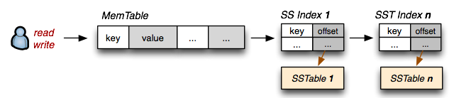

# 数据库查询之旅
> Performance is all about code path

30个列，总数50M，300条/用户，2个大字段总共2K，总长度250byte/记录  
S1一张表，S2主表(90%) + 详情表(10%)  
109Kbyte/索引  

||S1|S2|备注|
| -- | -- | -- | -- |
|1个数据块记录详情|8K*0.8 div (2K+250) ≈ 3|8K*0.8 div 250 ≈ 26，8K*0.8/2K ≈ 3|
|查询计划|
|索引记录详情|8K*0.6 div 109≈45||索引空间利用率为60~70%|
|索引查询|4+300/45 ≈ 11|
|内存I/O|(300 div 3)* 1.5+11≈161|(300 div 26)* 1.5+11≈29|用户记录离散程度为1.5（？这里是否必要引入）|
|磁盘访问I/O|161*(1-0.85)≈25|29*(1-0.85)≈5|缓存命中率为85%|
|总耗时|161*0.01+25*7≈177ms|29*0.01+5*7≈36ms|内存I/O 0.01ms，磁盘I/O 7ms，不算排队时间|

* 优化问题，把所有访问路径列出来
* 各种cache/各种延迟影响很大

[我对后端优化的一点想法](https://www.slideshare.net/jamestong/2012-12552732)  
[5-minute rule](http://www.hpl.hp.com/techreports/tandem/TR-86.1.pdf)  
[Think Clearly About Performance](https://method-r.com/wp-content/uploads/2018/07/TCAP-from-MOTD2.pdf)
https://carymillsap.blogspot.com/2010/09/my-otn-interview-at-oow2010-which-hasnt.html

# 并发控制

> 事务是为了简化，解决数据库容错

* 当2个并发同时写一个数据
* 当读和写一个数据同时发生
* 多个数据同时写

> 数据库事务保证数据不被破坏（AID），其局限是数据库无法维护业务的**并发不可变条件**

## 弱隔离

> 为了HA/HP，事务可以丢弃

### 脏写

|T1|T2|T2结果|
| -- | -- | -- |
|W(A=50)|||
||W(A=100)+commit|:dog: 覆盖未提交的值|
|commit||A!=50|

### 脏读

|T1|T2|T2结果|
| -- | -- | -- |
||R(A)|72|
|W(A=96)|||
||R(A)|96 - :dog: 读取到其他事务未提交数据 |
|rollback|||

### 更新丢失 (汇款)

|T1(A给B 50)|T2(查看A和B总和)|T2结果|
| -- | -- | -- |
|R(A)||初始：A=100, B=100|
|A=A-50|||
|W(A)|R(A)|50|
||R(B)|100|
|R(B)|返回A+B|150|
|B=B+50|commit||
|W(B)|||
|commit|||

### 原子写-counter（2个读+写事务）

|T1|T2|T2结果|
| -- | -- | -- |
|R(A)=42|||
||R(A)|42|
|W(A+1)=43|||
||W(A+1)|43|

### 不可重复读

|T1|T2|T2结果|
| -- | -- | -- |
||R(A)|50|
|W(A=100)+commit|||
||R(A)+commit|100 - :dog: 多次读取相同数据结果不同|

### 幻读

|T1|T2|T2结果|
| -- | -- | -- |
||MAX|50|
|ADD(A=100)+commit||:dog: 幻读和不可重复读的区别=添加，影响的是where等范围查询|
||MAX+commit|100|

## 串行=强隔离
### 单线程实现
最简单的串行方式，比如Redis，
* 事务要数据量小，快速更新
* 或者内存可以装满数据，取消cache，允许直接读少量内存数据

但是性能被单个CPU核心限制

### 2PL=悲观=内存锁 + 协议

|变体|协议|脏读|脏写|不可重复读|更新丢失|幻读|评价|
| -- | -- | -- | -- | -- | -- | -- | -- |
|2PL|锁可以在事务中间释放|may|may|may|may|may|可能死锁|
|C2PL|2PL+1阶段就获取所有锁|||may|may|may|保守派，无死锁，有幻读|
|S2PL|X-lock在事务结束释放|||may|may|may|死锁，偏向读，读已提交|
|SS2PL|S-lock/X-lock都必须在事务结束释放||||may|may|可重复读|
|SS2PL+predicate（索引锁）|条件查询/更新/删除时，需要检查predicate锁||||||串行|

### OCC=完全乐观=[TO+SGT]+无锁
> 适合读写较短/竞争低的事务，事务终止数量严重影响性能，长事务可能会饿死

每个事务读写时间戳写到各自的workset
提交前验证下
更新当前workset到主存储（**随机写问题**），否则重试

|T1|value|created|deleted|
|--|--|--|--|
|A0|456|1|

|T2|value|created|deleted|
|--|--|--|--|
|A0|123|0|

### 现代混合=MVCC+2PL+GC
> 综合负载性能好，不一定性能好于OCC

每个tuple的修改都有一个版本记录
怎样记录跟存储模型有关

|version|value|created|deleted|
|--|--|--|--|
|A0|123|0|42|
|A1|456|42|-|

#### SI/SSI=MVCC（数据部分）+ OCC（验证规则）+ 无锁

||事务开始|可见性规则|不可见|事务提交|
|--|--|--|--|--|
|SI|所有已经提交的数据+所有没有提交的删除||正在处理的写事务+已经终止的事务+之后开始的事务|可能更新丢失|
|SSI|同上|跟踪正在提交的数据|同上|检查查询结果改变，回滚并重试|

#### 设计考虑
现代DBMS实现是以上方法的混合体

||协议|多版本存储方式|GC|索引|
|--|--|--|--|--|
|InnoDB|MV+2PL|Delta|VACUUM||

[cmu 15-445/645](https://15445.courses.cs.cmu.edu/fall2018/schedule.html)  
[ddia](https://book.douban.com/subject/26197294/)  
[2pl](https://en.wikipedia.org/wiki/Two-phase_locking)  

# 日志与恢复

## WAL

|LSN|pre-LSN|txn id|type|obj|before|after|
|--|--|--|--|--|--|--|
|002|001|T1|update|A|1|2|

## 确定性
deterministic concurrency control  
view serialization的条件是什么?  
死锁、SGT闭环  
DAG Directed acyclic graph  

# 数据建模和SQL
内联/外联/笛卡尔乘积  
union/union all区别  
left join  
数据建模中的设计考虑  
Generalization and Specialization  
数据库为响应时间  
数据库为高吞吐量  
范式和非范式  
Blob存储  
how to scale a database  
table corruption  
数据库监控/切换  
数据库连接池  
c3p0/druid  
JDBC  
Mybatis  

# 索引
> 不访问不必要的数据

## B树的深度问题
* 假设sizeof(key)=sizeof(next_node)=4 byte，**节点最大占用m*(4+4)=8*m byte**
* 假设sizeof(page)=4KB，m=4*1024/(4+4)=512，即**B树就是个512叉树**
* 假如有10M行数据，**B树最大深度有log(512/2, 10M)=2.9006~=3**，avl的深度log(2, 10M)=23.25

## 写优化LSM

|OP|B|LSM|
| ---- | ---- | ---- |
|写|1.REDO 2.getPage+**树分裂(可能)** 3. 1~3个页到disk|1.REDO+memtable 2.当达到阈值，后台线程合并segment|
|读|getPage+内存中查找row|memtable+**迭代查询其他SSTable索引**|
|更新|读操作+更新+disk|写操作+更新标记|
|删除||写操作+删除标记|

设计考虑
- 是否需要写优化

- segment的大小和合并策略
  查询失效时，加速迭代查询
  高并发锁
  lsm如何保证迭代读取次数
- B树叶节点到底是存值`聚集索引`，还是文件偏移

## 多列索引和R-tree
复杂的条件查询通常会包含多列，普通的索引查询只能用到前缀匹配

## 布隆过滤

[SSTable](http://www.igvita.com/2012/02/06/sstable-and-log-structured-storage-leveldb/)  
[MySQL索引背后的数据结构及算法原理](http://blog.codinglabs.org/articles/theory-of-mysql-index.html)  
[浅谈MySQL的B树索引与索引优化](https://monkeysayhi.github.io/2018/03/06/%E6%B5%85%E8%B0%88MySQL%E7%9A%84B%E6%A0%91%E7%B4%A2%E5%BC%95%E4%B8%8E%E7%B4%A2%E5%BC%95%E4%BC%98%E5%8C%96/)  
[Relational Database Index Design and the Optimizers](https://book.douban.com/subject/26419771/)  

# 查询管理
iterator/volcano  
materialization  
vectorized  

# 批处理
Hadoop, Spark实现原理

# 存储引擎
数据访问模式

## 非结构化对象存储
s3实现原理

## 列式存储
Vertica  
Greenplum  
Redshift 做海量数据queriable存储  

## 列族存储
HBase 做scan more， get less 存储  
DynamoDB/Cassandra 做get more，scan less存储  
HIVE  

## 全内存
memcache 仅仅作为cache  
redis  
内存数据库，做高速响应queriable存储（其实是cache）  
nvm  

## 经典行式存储
get少，scan少，低延迟

### 关系模型
依赖多表join  
单表10M~100M量级？  
产品mysql, oracle  

### 文档模型
避免join  
大多数据1对多  
文档内查询弱  
产品mongodb  

### mysql分库分表中间件
单表5M，分表数=ceiling(N / (RDS 实例数 * 8) / 5,000,000)  
N=100M行数据量

Cobar属于阿里B2B事业群，始于2008年，在阿里服役3年多，接管3000+个MySQL数据库的schema,集群日处理在线SQL请求50亿次以上(由此可以计算：Cobar的TPS=5,000,000,000/(3000*24*60*60)=20)

|特性|Cobar|MyCAT|DRDS|
| ---- | ---- | ---- | ---- |
|前端MySQL协议|✅|✅|✅|
|SQL||SQL92||
|事务|2PC|弱XA|强XA+2PC+柔性事务|
|读写分离||✅||
|分库路由||✅|hash|
|分表路由||✅|hash+时间|
|后端协议|MySQL|MySQL+JDBC||
|IO|NIO+BIO|AIO||
|join||库内任意+跨库2表|任意|
|子查询||1层|[支持列表](https://help.aliyun.com/document_detail/71295.html?spm=a2c4g.11186623.2.11.75093f68Qi2HQX)|
|聚合||✅|智能下推|

比如一个简单的AVG操作，对于一些比较初级的分布式数据库模型而言，常见做法是把AVG直接下发到所有存储节点，这样造成的结果就是语法兼容，语义不兼容，最终拿到的是错误结果。而DRDS的智能下推引擎，对SQL的语法做充分的语义兼容性适配，针对AVG操作，只能由引擎将逻辑AVG SQL解析优化为SUM和COUNT的SQL然后进行下推，由底层的数据库实例节点完成SUM和COUNT计算，充分利用底层节点的计算能力，在引擎层将各个存储节点的SUM和COUNT结果聚合计算，最终计算出AVG。

[mycat权威指南](http://www.mycat.io/document/mycat-definitive-guide.pdf)  
[column-oriented vs column-family](https://dbmsmusings.blogspot.com/2010/03/distinguishing-two-major-types-of_29.html)  
[数据库相关中间件收录集](https://blog.csdn.net/u013256816/article/details/52769297)  
[跨时代的分布式数据库 – 阿里云DRDS详解
](https://www.csdn.net/article/a/2015-08-28/15827676)

# TODO
[cmu 15-721](http://15721.courses.cs.cmu.edu/spring2017/schedule.html)  
[cmu pavlo](http://www.cs.cmu.edu/~pavlo/datasets/index.html)  
https://dev.mysql.com/doc/internals/en/date-and-time-data-type-representation.html
[sfu](https://sfu-db.github.io/dbsystems/)  
[db-how](http://coding-geek.com/how-databases-work)  
[Comparison of different SQL implementations](http://troels.arvin.dk/db/rdbms/)  
[dbms wiki](https://en.wikipedia.org/wiki/Comparison_of_relational_database_management_systems)  

http://www.gpfeng.com/  
http://www.notedeep.com/note/38  
http://www.redbook.io/  
https://fgiesen.wordpress.com/category/papers/  
http://blog.yufeng.info/  

Xpress， 解LP MIP  
Hadoop MapReduce，Spark 做海量数据批处  
Storm/trident，做实时分布式消息处理   
Flume, 海量数据收集with high availability  
Hive/SparkSQL，做大数据在线分析   
专业数据库 ap 时间序列 文档 图表 数据处理工具 hadoop spark flink  

[SIGMOD](https://dl.acm.org/event.cfm?id=RE227&tab=pubs)  
[VLDB](http://vldb.org/pvldb)  
