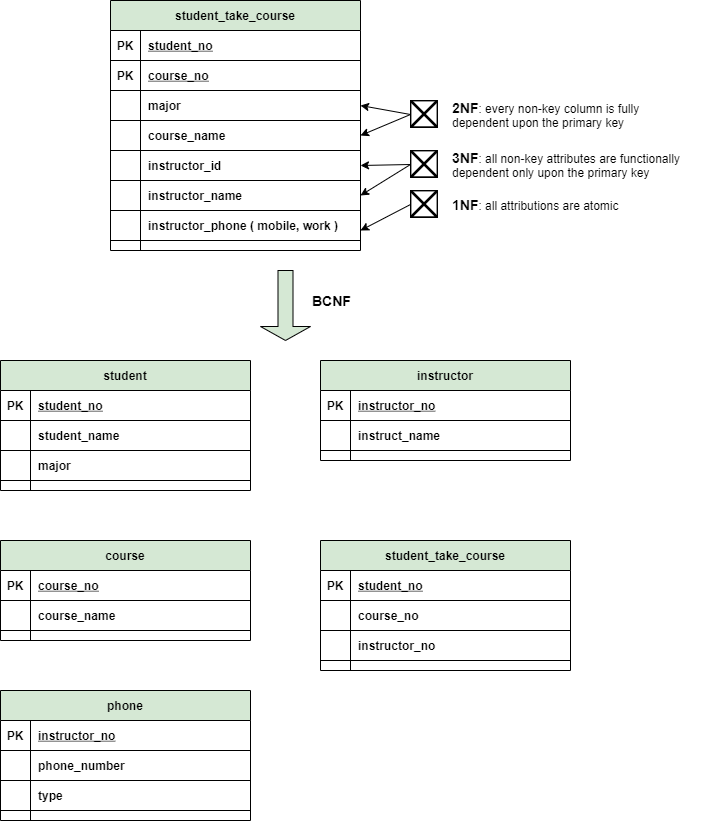
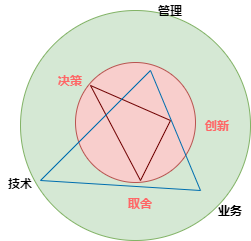

[ArchSummit全球架构师峰会](http://www.archsummit.com/)

[martin](https://martinfowler.com/tags/application%20architecture.html)  
[radar-thoughtworks](https://www.thoughtworks.com/radar/techniques)

[Azure Architecture Center](https://docs.microsoft.com/en-us/azure/architecture/)  
[AWS Architecture Center](https://aws.amazon.com/architecture)  

# 系统分析

> 理解并明确系统应该做什么。  
> 把复杂的问题**解耦**为一个个更小的，更容易理解的模块。  
> 把领域问题结构化、文档化为需求模型（用例描述、活动图、领域模型、SSD）  


[Systems Analysis and Design in a Changing World, Satzinger2016](https://www.amazon.com/Systems-Analysis-Design-Changing-World/dp/1305117204)  
系统分析部分讲得很清楚，整个书把软件开发的方方面面讲得很具体。 

[Systems Analysis and Design: An Object-Oriented Approach with UML](https://www.amazon.com/Systems-Analysis-Design-Object-Oriented-Approach/dp/1118804678/ref=zg_bs_602672_46?_encoding=UTF8&psc=1&refRID=PKYB5W8Q8TXME0HQZ945)

[Object-Oriented Software Engineering - An Agile Unified Methodology](http://www.doc88.com/p-24061870292509.html)

https://www.umsl.edu/~sauterv/analysis/488_f01_papers/quillin.htm#Top  
http://www.umsl.edu/~sauterv/analysis/analysis_links.html  


[大话软件工程——需求分析与软件设计](https://book.douban.com/subject/35044776/)

[Design It!: From Programmer to Software Architect](https://book.douban.com/subject/34795642/)


## 发现需求、干系人、需求引出


功能性需求=业务用途必要的活动。  
每个公司都有自己的一套规则业务规则和流程，有些很容易理解；有些则很难被发现。 

采访干系人，学会提问引导出业务过程的细节；控制话题节奏，避免简单复述和错失重点。  
如果可能的话，使用第一原理重新审视业务问题。  
寻找异常和错误条件，就会发现隐藏的业务规则细节。  
散发和搜集问卷、复查现存文档、现场观察业务、研究友商解决方案。  
快速迭代，干系人参与早期版本，收集活跃用户评论和建议。  

:star:
```diff
- 比起航天工程，信息系统更加的无形，<模型>是系统某一部分的抽象表示，同时也是系统可视化工具，是分析师与用户和设计师交流的工具，也是程序员理清系统行为的工具。
```
系统开发方法=各种模型+工具+技术组合

[Top risks, 2001](http://sunnyday.mit.edu/16.355/lawrence-requirements.pdf)  

[Requirements Engineering, 2000](http://mcs.open.ac.uk/ban25/papers/sotar.re.pdf)  

[Software Requirements (Developer Best Practices), wieger2013](https://www.amazon.com/Software-Requirements-Developer-Best-Practices-ebook/dp/B00JDMPMOA/ref=pd_sim_3?pd_rd_w=wKAhL&pf_rd_p=dc435707-6f1f-492e-b80d-8408db56abc9&pf_rd_r=S56C0MGWXZ88BWAF8NET&pd_rd_r=28ae2f52-e876-45d2-8c75-3771125ae848&pd_rd_wg=Exiv6&pd_rd_i=B00JDMPMOA&psc=1)

[Requirements Engineering: From System Goals to UML Models to Software Specifications, axel2011](https://www.amazon.com/Requirements-Engineering-System-Software-Specifications-ebook/dp/B00DWHU40E)

## 定义需求、确定用户故事和用例图


用户故事=WHO-WHAT-WHY 验收描述。更不形式化，倡导更快的到达程序分析师手上，鼓励直接与用户沟通，避免过多文档。  
用例=响应用户请求的一次活动。强调分析师优化和建模。  

用户目标技术=按功能角色分类用户+目标描述  
事件分解技术=外部事件+时序事件+内部事件  
用例图突出了actor与系统的功能关系。  

[Object-Oriented Analysis and Design with Applications, booch07](https://book.douban.com/subject/2266843/) 

[大话软件工程——需求分析与软件设计](https://book.douban.com/subject/35044776/)

[业务架构•应用架构•数据架构实战](https://book.douban.com/subject/35355450/)

[Righting Software：A Method for System and Project Design](https://book.douban.com/subject/35563799/)

[The Unicorn Project](https://book.douban.com/subject/35424121/)

[Agile Software Requirements, Leffingwell2015](https://book.douban.com/subject/26301944/)

[Essential Scrum](https://book.douban.com/subject/25887356/)

《知行》技术人的管理之路

[研发能力持续成长路线图]

[Refactoring to Patterns](https://book.douban.com/subject/1456190/)

## 实体，领域建模


**实体是现实世界的抽象，具体有形的东西、一次事件或者交互活动**就能表示现实世界的种种用例。    
头脑风暴需要分析师通过与用户沟通，结合用例和5W提问，分析和提炼出来。  
名字技术需要列出用例中使用的所有名词，从现有系统、流程和表单中，增加更多的细节，提炼出实体、属性以及他们之间的关系。

实体之间的关系=数量+通用/特殊+整体/部分  

确定实体的状态，以及业务逻辑控制状态转换。   

```diff
+ 领域类图既服务于数据库设计，又服务于设计类图
```

[企业IT架构转型之道：阿里巴巴中台战略思想与架构实战, 钟华2017](https://book.douban.com/subject/27039508/)

[软件架构设计：大型网站技术架构与业务架构融合之道](https://e.jd.com/30457722.html)

## 理解业务规则，用例建模

**领域类图和用例图**最好就在项目的早期就完整确定下来，以便为设计和开发服务。  
活动图主要用来描述在一个用例中，涉及的所有步骤，通常只包含2个actor，用户和系统。强调的是用户怎样与系统交互。  
系统顺序图强调的是输入与输出，以便指导设计。  
CRUD描述所有用户在每个用例中的权限。结合用户目的技术，用来交叉验证用例。  

[Applying UML and Patterns, larman04](https://book.douban.com/subject/1440149/)


# 系统设计

> 细节描述最终的系统会怎样实现（软件/硬件架构+UI）
> 输出决策记录和模型，以便构建出最终产品
> 软件架构：明确分层、分模块、关系、规则（4R，战略层）


[Fundamentals of Software Architecture, ford2020](https://book.douban.com/subject/34464806/)  
这本书，是迄今为止见过最全面关于软件架构的书。  
从架构技术、架构师职责，到软技能、职业规划。  

[Patterns of Enterprise Application Architecture, fowler02](https://book.douban.com/subject/1229954/)  
当我们在设计企业级应用时，这本书给出了一个思考框架。    
分层不仅仅意味着代码层面，物理上的分离也是需要考虑的。  

| 思考框架  |   |
|---|---|
| 业务逻辑组织  | 流程编排+领域逻辑  |
| 数据怎么操作  | 连接池+对象映射+序列化大对象+继承 |
| Web表现层  |   |
| 并发  | 隔离+不可变+乐观，悲观打底  |
| 会话表示  | 无状态  |
| 分布式策略  | 业务不变量边界+远程接口序列化  |


[37 Things One Architect Knows About IT Transformation](https://book.douban.com/subject/35062026/)

[system-desgin](https://github.com/donnemartin/system-design-primer)  

[Big Design Up Front](https://en.wikipedia.org/wiki/Big_Design_Up_Front)  

[archi vs design](https://www.slideshare.net/luctrudeau/architecture-vs-design)

[Continuous Architecture in Practice: Software Architecture in the Age of Agility and DevOps](https://www.amazon.com/Continuous-Architecture-Practice-Addison-Wesley-Signature/dp/0136523560)


[Foundations for the Study of Software Architecture, perry92, SIGSOFT](http://citeseer.ist.psu.edu/viewdoc/download?doi=10.1.1.135.5430&rep=rep1&type=pdf)

[New Tweets per second record, and how!](https://blog.twitter.com/engineering/en_us/a/2013/new-tweets-per-second-record-and-how.html)

[Software Architecture as a Set of Architectural Design Decisions, jansen05, WICSA05](http://www.ics.uci.edu/~andre/ics223w2006/jansenbosch.pdf)

[A Classification and Comparison Framework for Software Architecture Description Languages, medvidovic99, TOSE](https://www.ics.uci.edu/~andre/informatics223s2009/medvidovictaylor.pdf)

[Software design for large system, 1988](https://web.njit.edu/~kirova/BC-SDP.pdf)  


## **描述**二方和三方系统通信、组织现存的技术架构

明确现存技术环境，以便做出合适的设计决定。  
明确在一个特定的技术环境中，系统是怎样工作的。  

[架构漫谈, 2016](https://www.infoq.cn/article/an-informal-discussion-on-architecture-part01)  

[TOGAF](https://en.wikipedia.org/wiki/The_Open_Group_Architecture_Framework)

[archimate](https://pubs.opengroup.org/architecture/archimate31-doc/chap01.html#_Toc10045266)

[ISO/IEC/IEEE 42010/42020/42030](http://www.iso-architecture.org/42010/)  

[IEEE 1016](https://perso.univ-st-etienne.fr/jacquene/gl/articles/IEEE-1016-2009.pdf)

[Architectural Blueprints - The 4+1 View Model of Software Architecture, kruchten95, rational](https://www.cs.ubc.ca/~gregor/teaching/papers/4+1view-architecture.pdf)

[sebok](https://www.sebokwiki.org/wiki/Guide_to_the_Systems_Engineering_Body_of_Knowledge_(SEBoK))

http://wiki.ccose.org/index.php/%E9%A6%96%E9%A1%B5

## 确定系统规格、评价准则（非功能需求、质量属性）


> Understanding **the speed at which your organisation or business changes** is important

[ISO/IEC 25010](https://iso25000.com/index.php/en/iso-25000-standards/iso-25010)

[ch4~ch7 Fundamentals of Software Architecture, ford2020](https://book.douban.com/subject/34464806/)  
定义了各种系统规格，适用范围，相互影响。  
共生性=如何度量组件划分好坏和粒度。  
没有最好的架构，只有权衡比较后的次中求好。   
与领域干系人开会时，捕捉关键的关注点，并转换成规格。  
善于发现需求文档中，隐藏的规格信息。  
存在这样一种映射=领域关注点->架构规则组合->技术实现方案  

[Quality Models in Software Engineering Literature, Al-Qutaish09](http://www.sciencepub.net/american/am0603/22_2208_Qutaish_am0603_166_175.pdf)

[Building Secure & Reliable Systems](https://book.douban.com/subject/34796016/)

[Architecting for scale, 2016](https://book.douban.com/subject/27071892/)  


|规格||技术|
| ---- | ---- | ---|
|低成本|||
|高效性||集群、缓存服务、读写分离、分库分表、单机架构、负载均衡|
|扩展性（边际成本）|适应变化的能力、可理解性、可修改性|分层、DDD、SOA、微内核|
|可用性（沉默成本）|服务总体持续时间|双机备份、FMEA、异地多活、熔断、降级、限流|
|兼容性（机会成本）  ||
|可伸缩性 |||
|可靠性|系统无故障地持续运行的概率||
|可测试性||全链路压测|
|可维护性||全链路跟踪、降级、下线、熔断|
|可观测性||日志、API、运维监控平台|


低成本与高性能、高可用、可扩展平衡  
1台服务器用3年，2W/年（购买，维护、折旧、电费）  

引入缓存、虚拟化、性能调优、高性能硬件、开源方案  


<br />

## 架构决策、应用组件、子系统


架构决策负责：结构（架构风格）、非功能规格、依赖（组件之间的依赖）、接口、构建技术（平台、框架、工具、语言）。  
编写ADR，记录决策的原因。 

[康威定律, 1967](http://www.melconway.com/Home/Conways_Law.html)  
系统设计最终会按物理组织结构来分=UI+后端+规则+DBA

[ch8 Fundamentals of Software Architecture, ford2020](https://book.douban.com/subject/34464806/)  
顶层设计分离技术=按技术能力分离+按领域分离。  
组件分解技术=基于actor/用例组件划分（用户端+管理端）+ 事件风暴（producer和worker分离）+ 工作流。  
确定最初的组件->装入需求到组件->检查组件的角色和责任->分析组件规则->调整优化。  

[On the Criteria To Be Used in Decomposing Systems into Modules, parnas72](https://www.win.tue.nl/~wstomv/edu/2ip30/references/criteria_for_modularization.pdf)

[Comparing techniques by means of encapsulation and connascence, page-jones92](https://dl.acm.org/doi/abs/10.1145/130994.131004)

[DDD](https://book.douban.com/subject/1418618/)  

[Patterns, Principles, and Practices of Domain-Driven Design, millett2015](https://book.douban.com/subject/24773322/)  


[模型]=领域逻辑中心-技术细节  
DDD=强调业务专家与开发团队配合=问题域分解成若干子域+沟通协调统一语言/模型+隔离模糊和腐烂+理解上下文。  
有时候反馈和快速市场验证是产品成功的核心，BBoM足够了，并不总是反模式。  
DDD不是关于代码设计模式的，也不是以代码为中心的，也不是让你写出优雅的代码，DDD更多的是强调通过协作解决问题。  

开发团队可以与领域专家、对系统业务流程熟悉的业务人员、其他干系人协作，也可以引入BA，利用他们的洞见、专业、经验产生有用的模型满足需求。  
```diff
+ 核心领域就是产品竞争的优势，核心领域会随着业务而演变。
```
把核心领域当成产品，而不是单个项目。核心领域也不是一开始就完美的。  
边界清晰比完美的模型/代码更重要。  

领域模型=团队模型=分析模型->**与分析模型绑定的**代码模型+使用统一语言+几乎没有技术关注点

```diff
+ 保持解决方案简单，并不是快速和骚操作，而是通过代码审查和结对编程，避免混乱和过度复杂。  
```
使用界限上下文来分治问题域。上下文确定了职责，帮助更好的组织代码和分解问题。
```diff
! 识别上下文=术语≈业务能力
```
上下文映射=[界线上下文之间的技术和组织关系模式](https://github.com/ddd-crew/context-mapping)=代码级的命名空间/项目

从14章开始战术部分，从代码层面讲怎样维护对象的**不可变性**和**表达力**，怎样平衡值与实体、怎样结合界限上下文设计、怎样平衡贫血和充血实体。  

repository模式隔离了领域模型和数据模型，隐藏了底层复杂的存储和持久化框架。

## 系统风格、架构模式

[Big Ball of MUD, foote97, PLoP](http://www.laputan.org/mud/mud.html) 

[ch9~ch18 Fundamentals of Software Architecture, ford2020](https://book.douban.com/subject/34464806/)  
充分评估分布式架构中的网络不可用、延迟、带宽、数据安全。  
分布式架构需要解决分布式日志、分布式事务、通信契约问题。  
按技术分层单体架构，权衡整体快速修改 | 专家，起初简单高效；越往后，修改后，测试和部署越麻烦。  
复用与耦合需要权衡。   
架构演变影响因素：对过去的反思、整个开发生态改变。  
架构选择因素：影响规格的业务、数据架构、组织变化。  
架构决策：单体还是分布式、数据流、同步还是异步服务间通信。 

[reactive design patterns](https://book.douban.com/subject/25870212/)
PPC/TPC

[Building Microservice](https://book.douban.com/subject/25881698/)  

[Microservices Patterns: With Examples in Java, 2019](https://book.douban.com/subject/33425123/)  

https://docs.microsoft.com/en-us/azure/architecture/microservices/migrate-monolith  
http://www.mit.edu/~richh/writings/  
https://blog.pragmaticengineer.com/software-architecture-is-overrated/

[微服务架构设计, 互联网金融公司](https://gudaoxuri.gitbook.io/microservices-architecture/)

[A Laboratory For Teaching Object-Oriented Thinking, beck89, oopsla](http://people.cs.pitt.edu/~chang/231/5spec/CRCcard/Beck-LaboratoryForTeachingOO.pdf)

https://github.com/MagicBowen/architecting_cloud_aware_applications/blob/master/Architecting_Cloud-Aware_Applications.md

https://newrelic.com/blog/best-practices/distributed-monolith-vs-microservices

https://www.jianshu.com/p/73b3aac644f9

## API接口和安全
契约式设计
https://stripe.com/docs/api/pagination

https://github.com/wuyichen24/spring-microservices-in-action/
wiki/Store-Clients-and-Users'-Credentials-to-DB#for-clients

https://codeaches.com/spring-cloud-security/
oauth2-authorization-jdbc-token-store

https://projects.spring.io/spring-security-oauth/docs/oauth2.html

https://zhuanlan.zhihu.com/p/137835878

https://www.secrss.com/articles/13507

https://blog.csdn.net/li1669852599/article/details/107925768


### 架构安全
网络隔离、流量清洗、机房切换

### 业务安全
保底限制
安全漏洞 安全框架 OWASP
内网安全 权限管控 shiro、spring security

[OWASP TOP10 App security](https://owasp.org/www-project-top-ten/
)  

## UI设计、原型

实体模型、故事卡、图形布局。  
在SSD出图时，往往伴随着原型出图。  
前端资源的分发和部署。  

[墨刀](https://modao.cc/)

# 架构设计原则、指南

### 拆分
> 拆分需要平衡内部复杂度和外部复杂度，先粗后细
> 每个请求控制涉及多少个模块，1个子系统由多少人负责

可扩展、高可用、高性能都依赖拆分  
高可用关注异常情况、高性能关注正常情况  

### 封装
过度设计 

[separation of concerns, Dijkstra82](https://www.cs.utexas.edu/users/EWD/transcriptions/EWD04xx/EWD447.html)

You Aren't Gonna Need It.  
If it ain't broke, don't fix it. 

[ch1, Fundamentals of Software Architecture, ford2020](https://book.douban.com/subject/34464806/)  
软件架构第一定律，软件架构中所有决定都是一种折中。  
软件构架第二定律，为什么比怎样做更重要。 

[Clean Architecture](https://book.douban.com/subject/30333919/)  


提出以企业业务规则和应用业务规则为核心，满足外部系统为目的涉及的“插件系统”。  
底层离中心业务越远越易变，高层中心业务规则是赚钱的法宝比较不易变。 

[Building Evolutionary Architectures, 2017](https://book.douban.com/subject/27148120/)  

[Just Enough Software Architecture](https://book.douban.com/subject/24872314/)    

[The Hillside Group](https://hillside.net/patterns/books)

[worse is better](http://dreamsongs.com/WorseIsBetter.html)  

[The Rule of Least Power, 2001](https://www.w3.org/2001/tag/doc/leastPower.html)  

[方法论——程序员的阿喀琉斯之踵](http://mindhacks.cn/2008/10/29/methodology-for-programmers/)  

[Architectural and philosophical points](https://www.w3.org/DesignIssues/)  

[Domain-Specific Languages, fowler2010](https://book.douban.com/subject/4775030/)

[Software Architecture in Practice, bass2013](https://www.amazon.com/Software-Architecture-Practice-3rd-Engineering/dp/0321815734)  


https://tech.meituan.com/2018/05/31/dp-account-high-avaliable-road.html

https://blog.csdn.net/ityouknow/article/details/81230412

https://www.jianshu.com/p/dfce30de7fe3

https://docs.oracle.com/cd/E19263-01/817-5764/architecture.html

https://web.njit.edu/~kirova/is663-s11.html  

https://handbookofsoftwarearchitecture.com/

https://book.douban.com/subject/30443578/

[Internet-arch](https://trac.tools.ietf.org/html/rfc3439)  

[Stop Learning Frameworks, 2018](https://sizovs.net/2018/12/17/stop-learning-frameworks/)  

[PEP 20](https://www.python.org/dev/peps/pep-0020/)  

https://www.d.umn.edu/~gshute/softeng/principles.html

合适：合适优于业界领先，资源、时间、业务、团队，认可度，设计出来的架构满足当时的业务需要  
简单：简单优于复杂，奥卡姆剃刀、复杂度，可靠性、可扩展性  
演化：演化优于一步到位，满足当前业务需求、迭代优化、重构重写  


# 工期估算

https://www.cnblogs.com/odoouse/p/13245945.html

https://diegobasch.com/why-software-development-estimations-are-regu

[中国软件行业基准数据](http://www.bscea.org/uploads/soft/201015/CSBMK-2020%E5%B9%B4%E4%B8%AD%E5%9B%BD%E8%BD%AF%E4%BB%B6%E8%A1%8C%E4%B8%9A%E5%9F%BA%E5%87%86%E6%95%B0%E6%8D%AE.pdf)

中国软件估算大会

https://www.codeproject.com/Articles/701642/Software-Estimation-by-example

[Software Estimation](https://book.douban.com/subject/1783543/)

https://www.atlassian.com/agile/project-management/estimation

https://pragprog.com/titles/gdestimate/software-estimation-without-guessing/

https://www.scrum.org/forum/scrum-forum/31862/story-points-complexity-vs-effort  

estimation factors in effort and complexity

敏捷估算与规划

practical software project estimation

software estimation without guessing

software project estimation

software sizing, estimation, and risk management

manage it

pmbok

GB/T 37507-2019 项目管理指南

https://developer.aliyun.com/article/206424

[Software Metrics](https://people.ucalgary.ca/~far/Lectures/SENG421/)

# 备选架构、架构方案
## 架构图
可视化描述信息系统的环境、组件和部署情况。  

[ch21 Fundamentals of Software Architecture, ford2020](https://book.douban.com/subject/34464806/)  

[Software Architecture for Developers, 2014](https://book.douban.com/subject/26248182/)  
权衡BDUF和演变式设计，软件架构中的争论，怎样产出图/文档

chart&flow  
[c4](https://c4model.com/)  
[mermaid: uml in markdown](https://github.com/mermaid-js/mermaid)  
[asciiflow](https://asciiflow.com/)

[Architecture decision record (ADR)](https://github.com/joelparkerhenderson/architecture_decision_record)   

## 数据库设计方案



可能是简单的文件列表。  
对象文件，图片、音频、视频、excel等存储决策。  
从领域类图开始，每个类对应一个设计数据库表、默认值、长度、类型。  
性能、安全。  

`ch6~ch7, db concept`  
数据库设计过程包括从概念设计（ER模型）到逻辑设计（数据库schema），到最后的物理设计（文件、索引、存储过程、视图）    
从ER模型到数据库schema的转换过程中，涉及到复杂属性映射、弱实体的映射、关系集合合并。  
泛化和特例化  

销售商品到底是客户和产品之间的关系，还是实体本身？  
用增加PK代替关系、关联的主键不应该出现在关系集合的图上  
到底是合并成属性，还是抽取成实体，取决于具体的业务。  

[SQL反模式](https://book.douban.com/subject/4898636/)  

[SQL Style Guide](https://www.sqlstyle.guide/)

[高性能MySQL(第3版)](https://book.douban.com/subject/23008813/)  

# 分析和评估架构风险


[ch20 Fundamentals of Software Architecture, ford2020](https://book.douban.com/subject/34464806/)  
通过开风险风暴会议，参会人根据架构图，来确认、达成共识、修改每个风险维度。


# 架构师职业、核心价值、软技能



> The most important single ingredient in the formula of success is knowing how to get along with people.

[ch22~ch24 Fundamentals of Software Architecture, ford2020](https://book.douban.com/subject/34464806/)  

定义架构决策，指导开发团队做技术决策。  
持续的学习新的技术和趋势。  
确保团队遵循架构决策和设计原则。  
多经历不同的框架、库、技术、平台和环境。  
多了解业务知识。  
构建自己的个人能力，包括团队合作、协调能力、领导力。  
架构师做的每个决定几乎都会遭到质疑，需要斡旋能力。  
团队管理指导力度=团队熟悉程度+团队大小+经验水平+项目复杂度+项目时长。  
团队不健康警告指标=过程损失+多元无知+旁观者效应。  
高效的架构师通过榜样作用领导团队，而不是title。  
对于架构师来说，知识的宽度比深度更重要。  


## 能力与职责

架构需要关注运维，指导开发；反过来运维需要关注开发、指导架构。  

在满足性能、安全、可用性基础上，保证业务线的正常运转    
架构师利用自身的经验，帮助团队识别和规避各类风险，给出简单、可行的解决方案（决定权在项目经理）    
保持系统的敏捷性、可扩展性、可维护性、可测试性

态度上对团队支持、对系统负责，在技术、业务、管理和资源等各类因素之间进行平衡、沟通与协调。

|象限 | 能力  |
|---|---|
| 架构  | 需求分析，应用架构分析与评审、应用安全规约  |
| devops  | CI/CD设计，核心业务运营数据监控、核心接口性能监控、线上bug监控与分析  |
| 工程  | 研发流程优化、项目结构与脚手架、分支提交与管理、接口管理、程序建模设计、静态分析工具    |
| 代码 | 代码评审、重构分析与计划、编码规范    |
| 团队  | 技术能力构建、最佳实践、生产力工具、培训、招聘    |
| 业务  | 领域知识  |

https://github.com/spring2go/engineer_competency_framework  

[架构师的职责与思考](https://github.com/aalansehaiyang/technology-talk/blob/master/system-architecture/%E6%9E%B6%E6%9E%84%E5%B8%88%E7%9A%84%E8%81%8C%E8%B4%A3%E4%B8%8E%E6%80%9D%E8%80%83.md
)


# 控制复杂度

> the discipline of **systems thinking** proves to be an invaluable tool in assessing exposure, opportunities, parametric sensitivities. 
> instrument–process–operand model

[the magic number seven, 1956](https://academic.microsoft.com/paper/1984314602/reference)

[Complexity, Mitchell2011](https://book.douban.com/subject/6749832/)

[控制论与科学方法论, 2005](https://book.douban.com/subject/1322336/)

[系统论，95](https://book.douban.com/subject/1008370/)

[System Architecture: Strategy and Product Development for Complex Systems](https://book.douban.com/subject/26938710/)  
分析了一种系统化的思考方式和识别方法，结合大量实例自顶向下剖析了架构复杂系统的过程，总结出系统分为形式和功能，通过分解和分层等方法破解复杂系统。


# Back-Of-The-Envelope 容量、带宽、延迟、性能评估

## SLA
|SLA|每天停机时间|每年停机时间|
| ---- | ---- | ---- |
|99%|14.40 mins|3.65 days|
|**99.9%**|1.44 mins|8.77h|
|99.99%|8.64s|52.60 mins|
|99.999%|864 ms|5.26 mins|
|99.9999%|84 ms|31.56s|

<br>

## 线上业务故障级别
|故障等级|说明|响应时间|修复时间|故障复审|
| ---- | ---- | ---- | ---- | ---- |
|P0|1.系统整体瘫痪。2.关键硬件/软件损坏，无法自动修复。3.间歇性/随机性/重复性重启/退出，客户业务无法正常|<=3小时|<=1个工作日|VP|
|P1|1.关键服务降级，客户业务受到严重影响。2.性能严重下降，无法自动修复。3.客户数据损失|<=4小时|<=3个工作日|总监|
|P2|1.部分服务异常，整体正常，客户业务影响不大/存在隐患。2.备用设施离线，主设备正常。3.系统指标受影响，客户业务受限|<=6小时|<=4个工作日|团队|
|P3|1.不在线的线路和端口损坏。2.安全重启。3.软件/硬件技术支持|<=24小时|<=5个工作日|团队|

<br>

## 延迟
> 响应时间 = 服务时间（性能） + 排队时间

<br>


[Latency Numbers Every Programmer Should Know](https://people.eecs.berkeley.edu/~rcs/research/interactive_latency.html)

|||
|---|---|
同机房|0.05ms
同城|0.5ms
异地|50ms

<br>

## 常用中间件性能评估
|名称|机器配置|性能|客户端|延迟|数据来源
|---|---|---|---|---|---|
haproxy|16c,64GB|2.4M CPS,30MB/s,20 clients|900 qps/c|[haproxy1.6](https://www.freecodecamp.org/news/how-we-fine-tuned-haproxy-to-achieve-2-000-000-concurrent-ssl-connections-d017e61a4d27/)
nginx|36c,40Gbps,16GB|760K QPS/250K CPS, 730K/10K|10KB/r|[nginx 1.9](https://www.nginx.com/blog/testing-the-performance-of-nginx-and-nginx-plus-web-servers/)
kafka|6c,1Gbps,32GB,7200 SATA| 820K TPS|100B/r，78MB/s，NIC基本打爆了|AVG 2ms,TP99 3ms|[kafka 0.8](https://engineering.linkedin.com/kafka/benchmarking-apache-kafka-2-million-writes-second-three-cheap-machines)
zookeeper|2c|20K~80K/3severs QPS|200ms/elect|[Zookeeper3.x](https://zookeeper.apache.org/doc/r3.6.2/zookeeperOver.html)
RabbitMQ|4c,40GB|44K TPS|serval B/r|1ms-500ms|[rabbitMQ 2.8](https://www.rabbitmq.com/blog/2012/04/25/rabbitmq-performance-measurements-part-2/)
Redis|8c,32GB,EBS,10Gbps|150K QPS,100 clients|1K/r|TP99<1ms|[redis 5.0](https://docs.keydb.dev/blog/2019/06/17/blog-post/),[Redis lab](https://redis.io/topics/benchmarks)

<br>

## 常见数据库性能评估
|名称|机器配置|TPC-C|延迟|数据来源
|---|---|---|---|---|
MySQL|24c,4TGB,SSD,25Gbps|380K tpmC|TP90 100ms|[tpcc TTA](http://tpc.org/results/fdr/tpcc/tta~tpcc~as-1124us-tnrp~fdr~2020-08-16~v01.pdf)


## 常见服务性能评估
|名称|机器配置|性能|客户端|延迟|数据来源
|---|---|---|---|---|---|
微信||14M QPS/635台服务器, 月活540M|40M/600=66K QPS/server|[100亿次红包](https://developer.51cto.com/art/202003/613210.htm)


http://zhangxun.com/_templates/tmpl_treeview2.aspx?sname=AgileBOK#

https://blog.csdn.net/rolt/article/details/107081176?spm=1001.2014.3001.5502