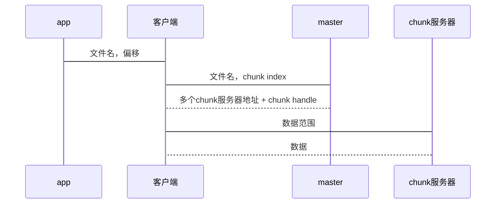
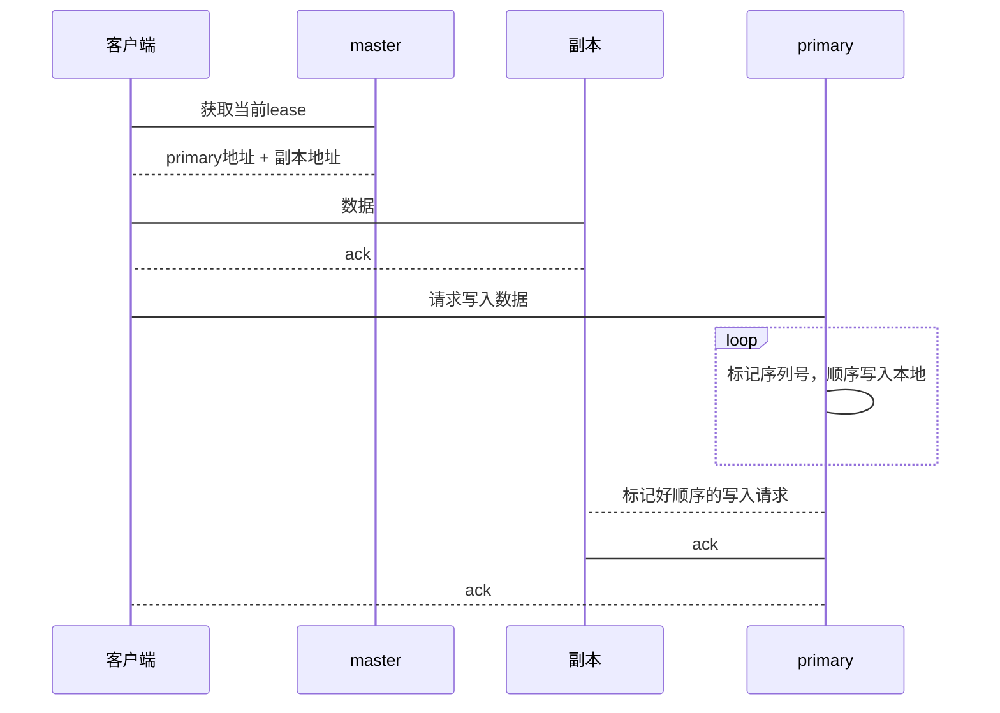
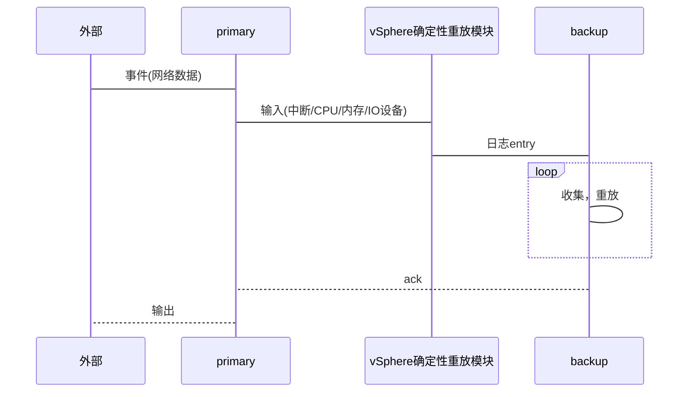

```mermaid
  sequenceDiagram
    app->客户端: 文件名，偏移
    客户端->master: 文件名，chunk index
    master-->客户端: 多个chunk服务器地址 + chunk handle
    客户端->chunk服务器: 数据范围
    chunk服务器-->客户端: 数据
```

```mermaid
  sequenceDiagram
    客户端->master: 获取当前lease
    master-->客户端: primary地址 + 副本地址
    客户端->副本: 数据
    副本-->客户端: ack
    客户端->primary: 请求写入数据
    loop 
        primary->primary: 标记序列号，顺序写入本地
    end
    primary-->副本: 标记好顺序的写入请求
    副本->primary: ack
    primary-->客户端: ack
```

```mermaid
  sequenceDiagram
    外部->primary:事件(网络数据)
    primary->vSphere确定性重放模块: 输入(中断/CPU/内存/IO设备)
    vSphere确定性重放模块->backup: 日志entry
    loop 
        backup->backup: 收集，重放
    end
    backup-->primary: ack
    primary-->外部: 输出
```

[mermaid-diagram](https://mermaidjs.github.io/mermaid-live-editor/#/)