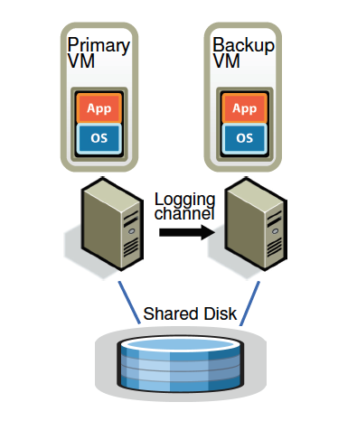
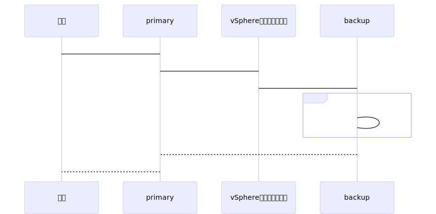

# 工作负载
硬件支持x86 hypervsor  
软件跑在VMWare vSphere 4.0上  
保证主备之间备份数据带宽<20Mb/s  
主机性能下降<10%  

# 动机
- VMWare vSphere x86平台VM容错
- 最大化可用性保护mission-critical应用
- 长距离容错

# 解决方案
主/备`执行确定性重放`  
共享磁盘作为外部状态(影响恢复和同步机制)  

> 类似binlog重放

# 局限
- 适合有长连接的关键业务
- 适合没法建设集群/难以维护的定制集群
- 不适合IO密集型业务

# 细节
## 同步重放
> 已有技术deterministic replay

## 失败检测
- 主/备心跳
- 日志流量
- 磁盘原子flag标识主/备切换(防止脑裂)

## 自动恢复
备机需要把所有机器内存和配置进行复制 (这需要中断primary within minutes)  
> 已有技术VMware VMotion自动集群备机重建

## 不确定性胶水
- 存储输出/存储竞争
- DMA造成内存竞争
- 时间日期

# 性能
对于网络IO密集型业务，开启FT收/发包有~30%的性能影响  
对于磁盘IO业务，数据密集型业务，性能能够保证<10%，但是带宽占用量是个风险  

[ft-vm](https://www.vmware.com/content/dam/digitalmarketing/vmware/en/pdf/techpaper/fttech.pdf)  
https://pubs.vmware.com/vsphere-51/index.jsp?topic=%2Fcom.vmware.vsphere.avail.doc%2FGUID-623812E6-D253-4FBC-B3E1-6FBFDF82ED21.html  