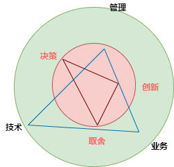

[CMU 17-313](https://cmu-313.github.io/?#schedule)

[MIT 16.355](http://sunnyday.mit.edu/16.355/)   
https://www.cs.uic.edu/~i442/

[CMU-SEI](https://sei.cmu.edu/)  
[MIT-SAL](http://systemarchitect.mit.edu/index.php)  
[ICSE Most Influential Paper Award](https://www.sigsoft.org/awards/icseMIPAward.html) 

https://blog.pragmaticengineer.com/

# 基本问题

[CS vs SE, Hoare09](https://reinout.vanrees.org/weblog/2009/07/01/ep-keynote.html)  
[什么是工程](https://en.wikipedia.org/wiki/Engineering)  
[CS != SE](http://www.cnblogs.com/buaashine/archive/2012/12/12/2813931.html)  
[We Are All Confident Idiots](https://www.guokr.com/article/439517/)  

[Software Engineering at Google: Lessons Learned from Programming Over Time, winters2020](https://www.amazon.com/Software-Engineering-Google-Lessons-Programming/dp/1492082791/ref=sr_1_1?crid=B3OX7H0MRN3B&dchild=1&keywords=software+engineering+at+google&qid=1618715077&s=books&sprefix=software+en%2Cstripbooks-intl-ship%2C530&sr=1-1)

颠覆了我对软件工程的认知  
软件工程是时间在编程上增加的一个维度  
开发任务!=软件工程任务  
随着组织变大、项目（版本）变多，开发产品和流程的效率是怎样的？我们必须选择和依赖更加严格的工程方法。    

[Become an Effective Software Engineering Manager, stanier2020](https://www.amazon.com/Become-Effective-Software-Engineering-Manager/dp/1680507249)

带我入门管理的一本书，
创造团队和条件，让其他人成功、学习、心理安全。 
工程师的特点和心流。  (怎样保持心流)。   
团队、领导。  
线上问题、紧急中断、拜访者到来、会议、跟进列表
使用工具来帮助自己不会忘记任何事情。  
信息收集、决策、推进、榜样  
管理的输出就是团队的输出、被管理影响的输出  
管理不仅仅意味着管人，还要管流程、招聘、沟通、交付

[软件项目成功之道](https://book.douban.com/subject/6748308/)

[格鲁夫给经理人的第一课，Grove95](https://book.douban.com/subject/27178870/)

[An Elegant Puzzle, Larson2019](https://book.douban.com/subject/33464445/)

[My final post regarding the flaws of Docker/Kubernetes and their eco-system,krubner2019](http://www.smashcompany.com/technology/my-final-post-regarding-the-flaws-of-docker-kubernetes-and-their-eco-system)

[Software Engineering for the 21st Century, mit04](http://www.cs.cmu.edu/~Compose/SEprinciples-pub-rev2.pdf)

[Apprenticeship Patterns](https://www.amazon.com/Apprenticeship-Patterns-Guidance-Aspiring-Craftsman-ebook/dp/B002RMSZ7E)

[The Mythical Man Month, brooks03](https://book.douban.com/subject/1105381/)

[Engeering: An endless frontier, Auyang2004](https://book.douban.com/subject/3287111/)

[Humphrey-SPA award](https://resources.sei.cmu.edu/news-events/events/watts/watts.cfm) 

[SE-history, 1996](https://www.dagstuhl.de/Reports/96/9635.pdf)  
https://en.wikipedia.org/wiki/Software_engineering  
https://en.wikipedia.org/wiki/Software_development  

[Engineering a Safer World, 2012](http://sunnyday.mit.edu/safer-world/index.html)  

[SE, 1968](http://homepages.cs.ncl.ac.uk/brian.randell/NATO/nato1968.PDF)  

[No Silver Bullet, 1986](http://sunnyday.mit.edu/16.355/BrooksNoSilverBullet2.html)  

[Software Engineering Economics, 1984](http://csse.usc.edu/TECHRPTS/1984/usccse84-500/usccse84-500.pdf)  

[SWEBOK, 2004](https://www.computer.org/web/swebok/index)  

[构建之法](https://book.douban.com/subject/27069503/)  

[A Multi-Decade Perspective, Scacchi, 2018](https://www.ics.uci.edu/~wscacchi/Papers/New/IEEE-Computer-Scacchi-2018.pdf)  

[自我评价](http://www.cnblogs.com/xinz/p/3852177.html)

[What Every Engineer Should Know About Software Engineering, 07](https://book.douban.com/subject/2607747/)

[Manage It, johanna07](https://book.douban.com/subject/2143051/) 

软件产品开发为什么失败  
软件、软件危机、软件工程  
测试写到什么程度算足够

http://augmentsoftware.com/wp-content/uploads/2016/12/SWE-Parnas-IME-USP-GLD-PLT-2013-ewn_highlights.pdf

# 权衡与成本

[ch1, SEGA]()  
软件工程复杂性所带来的复杂的决策流程

# 绩效、效率和人员管理
> 开发人员规模控制、组成成分、外部招聘  
> 团队建设、培训晋升奖励  
> DevOps过程的进度、质量、效率相关数据化

[Accelerate](https://book.douban.com/subject/30192146/)

[技术运营](https://cloud.tencent.com/developer/article/1515171)

https://github.com/512mouse/09-devops-system-tool/blob/master/project_and_development_management.md

[Team Topologies: Organizing Business and Technology Teams for Fast Flow](https://book.douban.com/subject/35528423/)

[软件研发效能提升实践](https://blog.csdn.net/programmer_editor/article/details/121792959)

[软件工程能力漫谈](https://www.infoq.cn/article/vtvqwb0akyfidxatfhfu)

[百度现代化研发效能的提效与创新之路](https://www.163.com/dy/article/H5L9OCU50511CUMI.html)

http://www.devopsstandard.cn/index.html

[研发运营一体化（DevOps）能力成熟度模型](https://www.sohu.com/a/541438015_121216336)

https://cloud.ofweek.com/news/2022-02/ART-178804-8420-30549630.html

https://devops.phodal.com/maturity/team-topologies

# 项目计划、迭代计划、监控

> 团队规模，人员构成（分工，人数）  
> 研发交易成本决策/投入力度, 采购or自研  
> 计划毫无用处，但是制订计划必不可少

根据Vision文档，复查业务需求  
划分子系统、确定完成顺序、人员、紧急程度  
确定子系统组件、边界  
规划WBS  

[项目计划、进度与控制](https://book.douban.com/subject/10801087/)

[凤凰项目，2015](https://book.douban.com/subject/26644070/)  

[程序员的三门课](https://www.zhihu.com/pub/reader/119647389/chapter/1182332907921813504)  

[Code of Ethics & Professional Conduct](https://www.pmi.org/about/ethics/code)  

[技术核心管理者的时间](https://www.infoq.cn/article/aALWwYEdxFuuisM8e9u2)

GB/T 37507-2019 项目管理指南

# 任务分解与工期估算

> 工程师花多少精力

https://www.cnblogs.com/odoouse/p/13245945.html

https://diegobasch.com/why-software-development-estimations-are-regu

[中国软件行业基准数据](http://www.bscea.org/uploads/soft/201015/CSBMK-2020%E5%B9%B4%E4%B8%AD%E5%9B%BD%E8%BD%AF%E4%BB%B6%E8%A1%8C%E4%B8%9A%E5%9F%BA%E5%87%86%E6%95%B0%E6%8D%AE.pdf)

中国软件估算大会

https://www.codeproject.com/Articles/701642/Software-Estimation-by-example

[Software Estimation](https://book.douban.com/subject/1783543/)

https://www.atlassian.com/agile/project-management/estimation

https://pragprog.com/titles/gdestimate/software-estimation-without-guessing/

https://www.scrum.org/forum/scrum-forum/31862/story-points-complexity-vs-effort  

estimation factors in effort and complexity

敏捷估算与规划

practical software project estimation

software estimation without guessing

software project estimation

software sizing, estimation, and risk management

https://developer.aliyun.com/article/206424

# 团队协调与沟通

[ch2, SEAG]()  

底层原理=人性+尊重+信任=成人自我

[ch3, 软件项目成功之道]()

每日站会+任务清单+时间预估

[ch5, SEAG]()  
个人工作、委托、人员管理之间平衡
对齐产品与团队任务      
解决内部冲突，做决策  
技术决策和方向的影响力  
组织外成事能力  

[驱动力](https://book.douban.com/subject/10484712/)

[团队协作的五大障碍](https://book.douban.com/subject/4235591/)

[Practical Ways to Manage Yourself: Modern Management Made Easy](https://www.amazon.com/Practical-Ways-Manage-Yourself-Management/dp/1943487138)

[Build](https://book.douban.com/subject/35685625/)

[第五项修炼](https://book.douban.com/subject/4051739/)

[坚毅](https://book.douban.com/subject/27062574/)

[成功，动机与目标](https://book.douban.com/subject/22994632/)

[终身成长](https://book.douban.com/subject/27154533/)

[The Successful Software Manager The definitive guide to growing from developer to manager]()

[agile project management with scrum]()

[7人团队敏捷管理手册](https://book.douban.com/subject/35481761/)

[create your successful agile project]()

[极简项目管理：让目标落地、把事办成并使成功可复制的方法论](https://book.douban.com/subject/35219808/)

https://paulhammant.com/2012/11/01/testability-and-cost-of-change/

# 文档与知识共享

# 不确定的SDLC、软件开发过程

[PDCA, deming86](https://asqaustin.org/wp-content/uploads/2015/12/History_of_the_PDSA_Cycle_CN_ASQ_Talk-_2_10_2016_Handout.pdf)   
现代企业质量控制的基石，也是PMP的理论基础。  

Scrum: The Art of Doing Twice the Work in Half the Time

[ch10, Systems Analysis and Design in a Changing World, Satzinger2015](https://www.amazon.com/Systems-Analysis-Design-Changing-World/dp/1305117204)  
非常明确的需求->使用可预测的过程到SDLC，基本顺序的执行五大过程组。  
作为人类可能会犯错，可能会忽略掉重要的组件。  
迭代/增量开发，加速了交付速度。 先把架子搭起，有部少量的功能，后续迭代出更多功能。  
敏捷建模=软件建模的态度=重要的领域建模+决策点建模。  
UP=回答每个迭代的重点是什么+UML+OOD=觉察阶段+协作阶段+构建阶段+转移阶段+4周/迭代+训练科目/阶段。  
XP=最佳实践=故事+TDD+结对编程+简单设计+重构代码+每人维护所有代码+CI+用户驻场+系统类比+小发布+遵循编码和文档标准。  
SCRUM=适合需求非常不明确=backlog+计划会议+冲刺+每日站会+复查会议

[Iterative and Incremental Development: A Brief History, 2003](https://www.craiglarman.com/wiki/downloads/misc/history-of-iterative-larman-and-basili-ieee-computer.pdf)  
70年代前：文档驱动-一次过的顺序生命周期  
70年代：早期的IID出现  
80年代：adaptive和evo出现，人们开始思考软件项目失败的原因  
90年代至今：IID大面积推广、Scrum/RAD/RUP/XP，直到如今的敏捷  

[Essential Scrum, rubin2014](https://book.douban.com/subject/25887356/)

[PSP, 1996](http://www.star.cc.gatech.edu/documents/SpencerRugabear/psp.pdf)  
[CMM, 1991](http://sunnyday.mit.edu/16.355/cmm.pdf)  
[The Agile Methods Fray](http://www-scf.usc.edu/~csci201/lectures/Lecture11/demarco2002.pdf)

[software process versus design quality, suryanarayana2015](https://ieeexplore.ieee.org/stamp/stamp.jsp?tp=&arnumber=7140652)

[selecting a development approach, cms05 ](https://www.academia.edu/13239574/SELECTING_A_DEVELOPMENT_APPROACH)

[a rational design process: how and why to fake it, parnas86, tose](https://www.cs.tufts.edu/~nr/cs257/archive/david-parnas/fake-it.pdf)

[managing the development of large software systems, royce1970](http://www-scf.usc.edu/~csci201/lectures/Lecture11/royce1970.pdf) 

[evolutionary development, gilb81, sigsoft](https://dl.acm.org/doi/pdf/10.1145/1010865.1010868)

[a spiral model of software development and enhancement, boehm88](http://www-scf.usc.edu/~csci201/lectures/Lecture11/boehm1988.pdf)  

[CHAOS95](https://www.projectsmart.co.uk/white-papers/chaos-report.pdf)

[SCRUM development process, Schwaber95](http://www.jeffsutherland.org/oopsla/schwapub.pdf)

[Extreme Programming Explained: Embrace Change, beck99](https://book.douban.com/subject/1440219/)

[agile manifesto, 2002](http://agilemanifesto.org/)

[Agile: The World's Most Popular Innovation Engine, 2015](https://www.forbes.com/sites/stevedenning/2015/07/23/the-worlds-most-popular-innovation-engine/#4d24af757c76)  

https://chrisshayan.atlassian.net/wiki/spaces/my/blog/2013/05/12/622650/Selecting+the+Appropriate+Development+Methodology

http://taoxie.cs.illinois.edu/index.htm

https://www.ifi.uzh.ch/en/seal/teaching/courses/archive/hs10-1.html

https://users.ece.utexas.edu/~perry/education/SE-Intro/

https://www.jackyshen.com/  
https://scrumguides.org/scrum-guide.html  
https://www.scrum.org/ 
http://umsl.edu/~sauterv/analysis/Agile%20Methodology%20and%20System%20Analysis.htm  

[The Heart of Agile](https://alistair.cockburn.us/wp-content/uploads/2018/02/The-Heart-of-Agile-Technical-Report.pdf)

https://modernagile.org/

https://techbeacon.com/app-dev-testing/modern-agile-heart-agile-new-focus-agile-development

https://en.wikipedia.org/wiki/Shuhari

[敏捷革命](https://book.douban.com/subject/27008697/)

[Lean Software Systems Engineering for Developers]()

[Joel on Software](https://book.douban.com/subject/1395496/)

[编程原则](https://book.douban.com/subject/35513153/)

[告别失控](https://book.douban.com/subject/26829089/)

[极客与团队](https://book.douban.com/subject/21372237/)

[敏捷转型：打造VUCA时代的高效能组织](https://book.douban.com/subject/30359317/)

[Making things hanppen]

[essential skills for the agile developer]

[start with why]

[project management for the unofficial project manager]

[learning domain-driven design]

# 回顾、复查、总结迭代
软件质量度量  
工作量评估

[精益软件度量](https://book.douban.com/subject/23009505/)

[程序员度量](https://book.douban.com/subject/21365482/)

[Agile Retrospectives: Making Good Teams Great](https://www.amazon.com/Agile-Retrospectives-Making-Teams-Great/)

# 软件工程师人性、个人发展

> 工程师的一天=编码+设计文档+解bug

[The Humble Programmer, turing lecture](https://dl.acm.org/doi/10.1145/355604.361591)

[Clean Coder, 2011](https://book.douban.com/subject/11614538/) 

[The Complete Software Developer's Career Guide, sonmez2017](https://book.douban.com/subject/35043940/)  
软件开发不仅仅是编程，在此之前还需要理清需求（大多数软件项目的目的都是自动化）、适量的设计，写完之后还要调试、测试、部署和监控。  

学习一门新的编程语言最佳实践：真实的项目->Hello World->学习基本的构建模块->区分语言内置特性和标准库->理解并build现有代码->刷题。  

程序员的手艺：开发语言（编译和运行平台、库和框架）、代码结构设计、OOD、算法和数据结构、数据库、源码控制、测试和调试、构建和部署、软件开发方法。  

[cracking the coding interview](https://book.douban.com/subject/26570695/)

[剑指Offer](https://book.douban.com/subject/25910559/)

[软技能](https://book.douban.com/subject/26835090/)  
至今为止看到软件开发工程师职业最强指南。  
**拥有商业心态**，把雇主当做软件开发企业的客户。  
每个人都希望自己很重要。  
**在一个专业方向上拥有专长**，思考专业化道路是会让自己受益，还是过度限制了自己的选择，类比律师。    
同时保有全职工作、开源节流、业余时间2小时/天新业务试错。  
持续不断增强业务能力，**确保长期客户、稳定的新客户**。  
作为一名软件开发人员，拥有成为一名企业家得天独厚的优势，不仅能提出概念和想法，还能把它创造出来。  
建立长远的理财思维，考虑物品的实际开销。  
**制定退休计划**，一方面缩减每个月的开支；一方面增加和确保自己的被动收入，包括且不仅限于购买增长型期权、高收益股票、基金、可租赁房产、存入退休账号、版权。  
退休=财务自由=不会由于财务状况用自己别无选择的方式，将自己的时间花费在不合心意的事情上。  

[The Effective Engineer, Lau2015](https://book.douban.com/subject/26360716/)

[Apprenticeship Patterns: Guidance for the Aspiring Software Craftsman, hoover2010](https://book.douban.com/subject/4924164/)

[卓有成效的程序员](https://book.douban.com/subject/3558788/)

[Pragmatic Thinking and Learning, hunt2011](https://read.douban.com/ebook/1885884/)

[The Seven Stages of Expertise in Software Engineering](http://www.wayland-informatics.com/The%20Seven%20Stages%20of%20Expertise%20in%20Software.htm)

[新事物炒作曲线(un-confirmed), gartner](https://en.wikipedia.org/wiki/Hype_cycle)

[代码精进之路：从码农到工匠](https://book.douban.com/subject/34922776/)

[Engineers Survival Guide](https://www.amazon.com/Engineers-Survival-Guide-Facebook-Microsoft/dp/B09MBZBGFK/ref=d_pd_sbs_sccl_2_3/138-8628425-9428532?pd_rd_w=4ov1F&content-id=amzn1.sym.3676f086-9496-4fd7-8490-77cf7f43f846&pf_rd_p=3676f086-9496-4fd7-8490-77cf7f43f846&pf_rd_r=B9J3B1NF1DBF4EXBRVBA&pd_rd_wg=Re3co&pd_rd_r=dc2e9acc-741e-4f62-be43-e927a2b7cd88&pd_rd_i=B09MBZBGFK&psc=1)

skill and self-evaluation

https://firstround.com/review/Responsiveness-New-Efficiency/  

http://www.cs.toronto.edu/~sme/CSC340F/  

https://simplicable.com/new/coding-principles  
https://about.gitlab.com/handbook/  
https://en.wikipedia.org/wiki/List_of_software_development_philosophies
http://blog.vgod.tw/
https://blog.youxu.info/
http://blog.54chen.com/
http://www.yankay.com
http://www.valleytalk.org

http://people.scs.carleton.ca/~deugo/Patterns/ospdg/
https://www.cs.cmu.edu/~aldrich/courses/413/

写给工程师的十条精进原则  
https://tech.meituan.com/2018/08/16/10-principles-for-engineers.html

https://www.cnblogs.com/cicada-smile/p/14579547.html

从码农到技术总监，如何提升自我修养？
https://new.qq.com/omn/20190824/20190824A049H300.html?pc  

Why Motivating People Doesn't Work . . . and What Does  
https://www.amazon.com/Motivating-People-Doesnt-Work-What/dp/1626569452/ref=sr_1_18?crid=U700ZYNJZF0A&keywords=microservice&qid=1650727070&s=books&sprefix=microserv%2Cstripbooks-intl-ship%2C1149&sr=1-18

# 架构师职业、核心价值、软技能

> The most important single ingredient in the formula of success is knowing how to get along with people.

[ch22~ch24 Fundamentals of Software Architecture, ford2020](https://book.douban.com/subject/34464806/)  

定义架构决策，指导开发团队做技术决策。  
持续的学习新的技术和趋势。  
确保团队遵循架构决策和设计原则。  
多经历不同的框架、库、技术、平台和环境。  
多了解业务知识。  
构建自己的个人能力，包括团队合作、协调能力、领导力。  
架构师做的每个决定几乎都会遭到质疑，需要斡旋能力。  
团队管理指导力度=团队熟悉程度+团队大小+经验水平+项目复杂度+项目时长。  
团队不健康警告指标=过程损失+多元无知+旁观者效应。  
高效的架构师通过榜样作用领导团队，而不是title。  
对于架构师来说，知识的宽度比深度更重要。 

## 业务能力成熟度
https://jiagoushi.pro/business-capability-maturity

https://www.smartcity.team/consultingskills/experience/%E4%B8%9A%E5%8A%A1%E6%9E%B6%E6%9E%84%E6%98%AF%E4%BB%80%E4%B9%88/

https://www.jianshu.com/p/bd9962ba3c22

https://tech.meituan.com/2018/04/16/study-vs-work.html

https://mikechen.cc/7533.html

http://iperson.uml.com.cn/SA/qualifications.asp

https://www.infoq.cn/article/ngrof3ekpo0rsm5y2ajb

https://juejin.cn/post/6991387551646892063

http://www.woshipm.com/kol/5197192.html

https://www.nankingcigar.com/2021/05/28/jia-gou-shi-jian.html

## 技术能力与职责

架构需要关注运维，指导开发；反过来运维需要关注开发、指导架构。  

在满足性能、安全、可用性基础上，保证业务线的正常运转    
架构师利用自身的经验，帮助团队识别和规避各类风险，给出简单、可行的解决方案（决定权在项目经理）    
保持系统的敏捷性、可扩展性、可维护性、可测试性

态度上对团队支持、对系统负责，在技术、业务、管理和资源等各类因素之间进行平衡、沟通与协调。

|象限 | 能力  |
|---|---|
| 架构  | 需求分析，应用架构分析与评审、应用安全规约  |
| devops  | CI/CD设计，核心业务运营数据监控、核心接口性能监控、线上bug监控与分析  |
| 工程  | 研发流程优化、项目结构与脚手架、分支提交与管理、接口管理、程序建模设计、静态分析工具    |
| 代码 | 代码评审、重构分析与计划、编码规范    |
| 团队  | 技术能力构建、最佳实践、生产力工具、培训、招聘    |
| 业务  | 领域知识  |

https://github.com/spring2go/engineer_competency_framework  

[架构师的职责与思考](https://github.com/aalansehaiyang/technology-talk/blob/master/system-architecture/%E6%9E%B6%E6%9E%84%E5%B8%88%E7%9A%84%E8%81%8C%E8%B4%A3%E4%B8%8E%E6%80%9D%E8%80%83.md
)

## 技术领导力

[Peopleware](https://book.douban.com/subject/25956450/)  

### 技术分享、读书会
分享范围  
专利  
论文  

### 技术规划、目标管理