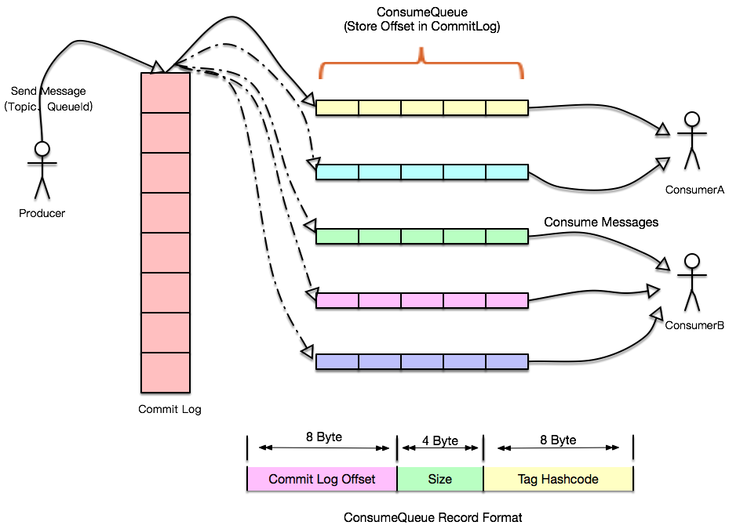

# 开发参考
* [tcp](https://tools.ietf.org/html/rfc793)
* [http/1.1](https://tools.ietf.org/html/rfc2616)
* [nginx](http://nginx.org/en/)
* [jdk](https://docs.oracle.com/javase/10/)
* [mysql 8.0](https://dev.mysql.com/doc/refman/8.0/en/)
* [mysql 5.7](https://dev.mysql.com/doc/refman/5.7/en/)
* [mysql internal](https://dev.mysql.com/doc/internals/en/)
* [spring](https://docs.spring.io/spring/docs/)
* [dubbo](http://dubbo.apache.org/zh-cn/docs/user/quick-start.html)
* [maven](http://maven.apache.org/)
* [git](https://git-scm.com/docs)
* [amqp](https://www.rabbitmq.com/protocol.html)
* [cron](http://www.quartz-scheduler.org/documentation/quartz-2.x/tutorials/crontrigger.html)

# 源码
* [redis](https://github.com/antirez/redis)
* [spring](https://github.com/spring-projects/spring-framework)
* [jdk7-hotspot](https://github.com/openjdk-mirror/jdk7u-hotspot)
* [jdk7-jdk](https://github.com/openjdk-mirror/jdk7u-jdk)
* [mysql](https://github.com/mysql/mysql-server)
* [linux](https://github.com/torvalds/linux)
* [guava](https://github.com/google/guava)  
* [Azure Architecture Center](https://docs.microsoft.com/en-us/azure/architecture/)  
* [AWS Architecture Center](https://aws.amazon.com/architecture)  

# 通用架构设计
microservice/SOA/Lambda Architecture  

[Patterns of Enterprise Application Architecture, 2003](https://book.douban.com/subject/1230559/)  
[Building Microservice](https://book.douban.com/subject/25881698/)  

https://lethain.com/digg-v4-architecture-process/  
[程序员的呐喊](https://book.douban.com/subject/25884108/)  
https://www.w3.org/DesignIssues/  
https://firstround.com/review/the-rewards-of-creator-driven-cultures-and-the-engineers-that-can-deliver-them/  

分布式ID发号器、feed 系统、缓存系统、推荐系统、抢票系统  
社区类服务架构、云服务架构、O2O  

[分布式Redis架构设计, 2015](https://mp.weixin.qq.com/s?__biz=MzAwMDU1MTE1OQ==&mid=208733458&idx=1&sn=691bfde670fb2dd649685723f7358fea)  
[亿级用户下的新浪微博平台架构](https://www.infoq.cn/article/weibo-platform-archieture)  

https://github.com/akullpp/awesome-java#science

# 企业级架构设计

## 用户系统

1. 账户系统
三用户模型
http://doc.cocolian.cn/essay

2. 点券系统
http://www.woshipm.com/pd/913433.html
http://www.woshipm.com/pd/836586.html
https://juejin.im/post/5b06851251882538b82c3e1f
https://www.jianshu.com/p/bc56e676298f

3. 支付系统

## 电商服务架构
商品管理  
订单系统  
下单流程  
库管  
[TableStore实战：亿量级订单管理解决方案](https://yq.aliyun.com/articles/656196?spm=a2c4e.11154837.920241.5.464642b2YuhDE6)  

## 实时消息

|名称|集群数量|CPU|内存|存储|网络|单机|集群长连接|消息下发|
|--|--|--|--|--|--|--|--|--|
|360push服务|9集群，400物理机，3000实例|-|128GB|-|-|800K长连接，20K QPS|10M|10M/分钟，百亿/天,
|京东云消息|-|-|-|-|-|1.18M长连接|-|-

消息推送
iot
android/ios
h5

单机连接数/内存使用量
消息下发量/s
心跳
耗时业务

[Netty 百万级推送服务设计要点](https://www.infoq.cn/article/netty-million-level-push-service-design-points)  

emqtt.io

## 身份认证
用户系统
SSO
登录系统
权限系统

# 实战工具箱
## web框架/容器
servlet/tomcat
依赖注入
AOP原理
spring/springmvc
Spring初始化bean  
bean销毁  
面向切面编程
SpringSession默认用cookie保存和传递sessionid

https://docs.spring.io/spring/docs/current/spring-framework-reference/overview.html\#spring-introduction  
[https://en.wikipedia.org/wiki/Aspect-oriented\_programming](https://en.wikipedia.org/wiki/Aspect-oriented_programming)  
[https://www.ibm.com/developerworks/cn/java/j-aop/index.html](https://www.ibm.com/developerworks/cn/java/j-aop/index.html)  
[https://zhuanlan.zhihu.com/p/24565766](https://zhuanlan.zhihu.com/p/24565766)  
[http://www.importnew.com/26951.html](http://www.importnew.com/26951.html)  
[http://kubicode.me/2015/07/30/Java Base/Java-AOP-Study/](http://kubicode.me/2015/07/30/Java Base/Java-AOP-Study/)

## 远程通信
dubbo/thrift

## 持久化框架
jdbc/mybatis  
job框架/shiro  

## 性能测试

https://help.aliyun.com/document_detail/29262.html?spm=a2c4g.11174283.6.543.2df91b3aU8Fq6m

## 企业级分布式应用服务

https://help.aliyun.com/product/29500.html?spm=a2c4g.11186623.6.540.1c66465dK4LT3j

## 消息队列

http://rocketmq.apache.org/docs/motivation/  
http://rocketmq.apache.org/rocketmq/how-to-support-more-queues-in-rocketmq/  
https://engineering.linkedin.com/distributed-systems/  log-what-every-software-engineer-should-know-about-real-time-datas-unifying  
https://www.confluent.io/blog/how-choose-number-topics-partitions-kafka-cluster/  

rabbitmq  
SQS，对性能无太大要求时，做简单队列, availability超好 

## 分布式应用配置
zk  
etcd

https://help.aliyun.com/document_detail/59957.html?spm=a2c4g.11174283.6.545.5c07613600nrB8

## 数据流

[Kafka: The Definitive Guide](https://book.douban.com/subject/26828527/)  
https://engineering.linkedin.com/distributed-systems/log-what-every-software-engineer-should-know-about-real-time-datas-unifying  
https://www.infoq.cn/article/2018/01/confluent-kafka-data  

[Kinesis](https://aws.amazon.com/cn/kinesis/)

https://zturn.cc/elkbook/

## 数据库
|名称|类型|QPS单机|QPS集群|TPS|RT|存储|scan|get|join|
|--|--|--|--|--|--|--|--|--|--|
|redis|内存|100K+|1M+||1ms|TB
|HBase|列族|-|?|10M+|1ms|PB|more|less
|Cassandra|列族|-|?|10M+|1ms|PB|less|more
|Hive|列族|-|?|10M+|1ms|PB|less|more
|Greeplum|列式|-|?|||||
|S3|对象|-||||||
|MongoDB|文档||||||x|x|
|SQL|行|100K+|-|||GB|x|x|x
|?|图|100K+|-|||GB|x|x|x
|?|时序|100K+|-|||GB|x|x|x

http://mysql.rjweb.org/doc.php/limits
https://dev.mysql.com/doc/mysql-reslimits-excerpt/5.6/en/limits.html

http://www.voidcn.com/article/p-biggriil-bhz.html

## 工作流/规则引擎

webhook
http://progrium.com/blog/2007/05/03/web-hooks-to-revolutionize-the-web/

https://sites.google.com/a/brown.edu/ugur-cetintemel/
https://data1030.github.io/
https://www.linkedin.com/pulse/big-data-velocity-plain-english-john-ryan/
https://www.allthingsdistributed.com/2018/06/purpose-built-databases-in-aws.html
