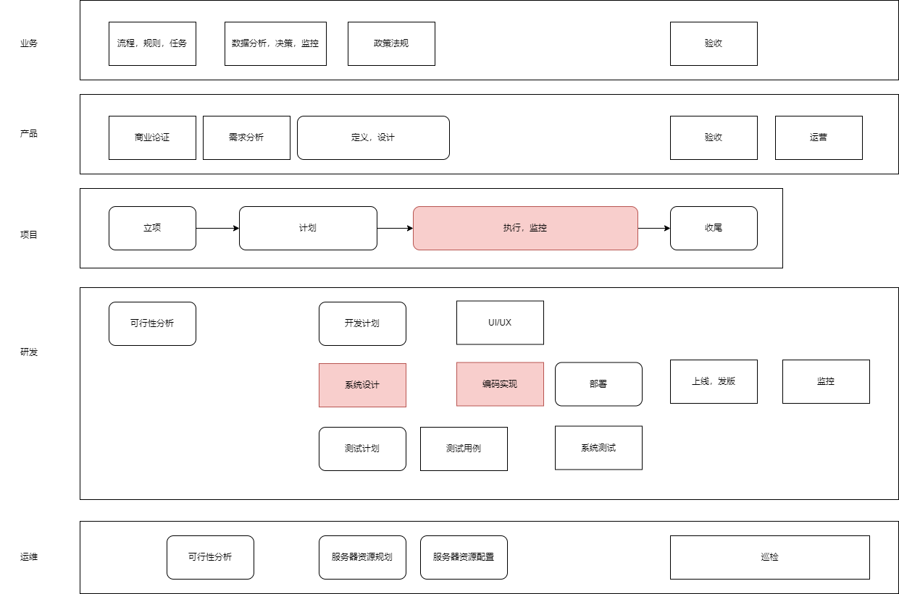

# 业务战略和产品

[princeton CS448 -Innovating Across Technology, Business, and Marketplaces](https://www.cs.princeton.edu/courses/archive/spring20/cos448/schedule.html)

[业务和领域专家](https://github.com/amitness/learning)

[产品研发管理](https://book.douban.com/subject/10433727/)

[重新定义公司]()

[Inspired, Cagan2017](https://book.douban.com/subject/27161852/)

[Empowered, Cagan2020](https://book.douban.com/subject/35157237/)

[High Growth Handbook: Scaling Startups From 10 to 10,000 People](https://www.amazon.com/High-Growth-Handbook-Elad-Gil/dp/1732265100/ref=pd_sbs_sccl_5/138-8628425-9428532?pd_rd_w=rWoqO&pf_rd_p=3676f086-9496-4fd7-8490-77cf7f43f846&pf_rd_r=MPGVN9HC2Q1M2XB4Y5TJ&pd_rd_r=8ea9f712-29da-4fed-bc01-a2c6b7f36cce&pd_rd_wg=ikXM4&pd_rd_i=1732265100&psc=1)

软件思维到底给战略和咨询带来了什么  
https://www.prossummit.com/blog/thoughtworks-ceo

## 企业架构
http://www.woshipm.com/zhichang/2879933.html

https://www.sohu.com/a/435166953_667714

https://www.smartcity.team/professional/%E4%BC%81%E4%B8%9A%E6%95%B0%E5%AD%97%E5%8C%96%E8%BD%AC%E5%9E%8B%E7%9A%84%E6%9E%B6%E6%9E%84%E9%80%89%E6%8B%A9/

https://www.coollf.com/archives/%E4%B8%9A%E5%8A%A1%E6%9E%B6%E6%9E%84%E5%AE%9E%E8%B7%B5%E4%B8%80%E6%AD%A5%E4%B8%80%E6%AD%A5%E7%94%BB%E5%87%BA%E4%B8%9A%E5%8A%A1%E6%9E%B6%E6%9E%84%E5%9B%BE

## 业务架构

> 矛盾：产品原型、流程与技术结构的不匹配

对齐企业战略，对企业能力进行**整体规划**  
将复杂的业务体系进行**整体性、结构化设计**  
有机的与技术实现对齐

BIZBOK

[企业级业务架构设计：方法论与实践](https://book.douban.com/subject/34801161/)

https://www.smartcity.team/consultingskills/experience/%E4%B8%9A%E5%8A%A1%E6%9E%B6%E6%9E%84%E6%98%AF%E4%BB%80%E4%B9%88/

[产品思维](https://mp.weixin.qq.com/s/fIqp3R2Tade2jInkrxordQ)

[业务分析师和产品经理](http://www.woshipm.com/pmd/3805700.html)

[The Innovator's Dilemma, Christensen02](https://book.douban.com/subject/1461932/)

[Shoe Dog, knight2016](https://book.douban.com/subject/26738885/)

[Zero to One, Thiel2014](https://book.douban.com/subject/24753651/)

[Creativity, Inc.](https://book.douban.com/subject/25777433/)

[商务与经济统计, Anderson D R. 2012](https://book.douban.com/subject/10557289/)

[市场营销原理, 科特勒2010](https://book.douban.com/subject/4830099/)

[The Hard Thing About Hard Things, Horowitz2015](https://book.douban.com/subject/26306686/)

[企业战略博弈, 格林沃德06](https://book.douban.com/subject/1967814/)

[国家竞争优势](https://book.douban.com/subject/6753831/)

[战争论, 05](https://book.douban.com/subject/1009105/)  

[Getting Real](https://basecamp.com/gettingreal/getting-real.pdf)

[四步创业法](https://book.douban.com/subject/11516567/)  

[创业者手册](https://book.douban.com/subject/20453004/)

[创新者的解答](https://book.douban.com/subject/4822145/)

[创业36条军规](https://book.douban.com/subject/26794032/)

[商业模式新生代](https://book.douban.com/subject/6718487/)

[创新的先知](https://book.douban.com/subject/4931700/)
 

# 立项批准、系统整体功能需求、整体解决方案

**项目经理**的核心技能是管理（计划，组织，领导，控制）

确认解决的问题  
对于公司来说，需要进行ROI分析，以决定是否做/自研or外包  
确认系统的功能、初步需要的经费  
输出System Vision Document  
召集所有核心人员，启动立项会议  

[ch11, Systems Analysis and Design in a Changing World](https://www.amazon.com/Systems-Analysis-Design-Changing-World/dp/1305117204)  
凡是涉及二人以上的项目，都需要决定分工、开发过程。  
项目失败的主要原因缺乏行政参与和项目管理技能。  
项目成功的标志=按时完成+预算内+高效满足需求。  
PM作为中心，需要对外汇报给客户、监督委员会，对内组织资源、计划、监控。  
项目管理规格=正式程度+文档生成的量级+规格可追溯性。  
敏捷项目管理需要平衡灵活性和对混沌的控制。  
大多数公司都是不停的想办法提高市场份额=长期+短期计划。  

[What Makes a Great Manager of Software Engineers, Kalliamvakou17](https://www.microsoft.com/en-us/research/uploads/prod/2018/06/kalliamvakou-tse-2018.pdf)

[软件开发之殇](http://career_book.siwei.me/)

[The Manager's Path, Fournier17](https://book.douban.com/subject/26997855/)  

[A Guide to the Project Management Body of Knowledge](https://book.douban.com/subject/24697645/)  
[汪博士解读PMP考试](https://book.douban.com/subject/24713754/)  

[项目管理方法论，2015](https://book.douban.com/subject/26584696/)  

https://www.esensoft.com/industry-news/dx-11387.html

# 整体项目计划、迭代计划、监控

> 计划毫无用处，但是制订计划必不可少

根据Vision文档，复查业务需求  
划分子系统、确定完成顺序、人员、紧急程度  
确定子系统组件、边界  
规划WBS  

[Practical Ways to Manage Yourself: Modern Management Made Easy](https://www.amazon.com/Practical-Ways-Manage-Yourself-Management/dp/1943487138)

[凤凰项目，2015](https://book.douban.com/subject/26644070/)  

[程序员的三门课](https://www.zhihu.com/pub/reader/119647389/chapter/1182332907921813504)  

[Code of Ethics & Professional Conduct](https://www.pmi.org/about/ethics/code)  

[技术核心管理者的时间](https://www.infoq.cn/article/aALWwYEdxFuuisM8e9u2)

# 回顾、复查、总结迭代
软件质量度量  
工作量评估

[精益软件度量](https://book.douban.com/subject/23009505/)

[程序员度量](https://book.douban.com/subject/21365482/)

# 不确定的SDLC、软件开发过程

[PDCA, deming86](https://asqaustin.org/wp-content/uploads/2015/12/History_of_the_PDSA_Cycle_CN_ASQ_Talk-_2_10_2016_Handout.pdf)   
现代企业质量控制的基石，也是PMP的理论基础。  

[ch10, Systems Analysis and Design in a Changing World, Satzinger2015](https://www.amazon.com/Systems-Analysis-Design-Changing-World/dp/1305117204)  
非常明确的需求->使用可预测的过程到SDLC，基本顺序的执行五大过程组。  
作为人类可能会犯错，可能会忽略掉重要的组件。  
迭代/增量开发，加速了交付速度。 先把架子搭起，有部少量的功能，后续迭代出更多功能。  
敏捷建模=软件建模的态度=重要的领域建模+决策点建模。  
UP=回答每个迭代的重点是什么+UML+OOD=觉察阶段+协作阶段+构建阶段+转移阶段+4周/迭代+训练科目/阶段。  
XP=最佳实践=故事+TDD+结对编程+简单设计+重构代码+每人维护所有代码+CI+用户驻场+系统类比+小发布+遵循编码和文档标准。  
SCRUM=适合需求非常不明确=backlog+计划会议+冲刺+每日站会+复查会议

[Iterative and Incremental Development: A Brief History, 2003](https://www.craiglarman.com/wiki/downloads/misc/history-of-iterative-larman-and-basili-ieee-computer.pdf)  
70年代前：文档驱动-一次过的顺序生命周期  
70年代：早期的IID出现  
80年代：adaptive和evo出现，人们开始思考软件项目失败的原因  
90年代至今：IID大面积推广、Scrum/RAD/RUP/XP，直到如今的敏捷  

[Essential Scrum, rubin2014](https://book.douban.com/subject/25887356/)

[PSP, 1996](http://www.star.cc.gatech.edu/documents/SpencerRugabear/psp.pdf)  
[CMM, 1991](http://sunnyday.mit.edu/16.355/cmm.pdf)  
[The Agile Methods Fray](http://www-scf.usc.edu/~csci201/lectures/Lecture11/demarco2002.pdf)

[software process versus design quality, suryanarayana2015](https://ieeexplore.ieee.org/stamp/stamp.jsp?tp=&arnumber=7140652)

[selecting a development approach, cms05 ](https://www.academia.edu/13239574/SELECTING_A_DEVELOPMENT_APPROACH)

[a rational design process: how and why to fake it, parnas86, tose](https://www.cs.tufts.edu/~nr/cs257/archive/david-parnas/fake-it.pdf)

[managing the development of large software systems, royce1970](http://www-scf.usc.edu/~csci201/lectures/Lecture11/royce1970.pdf) 

[evolutionary development, gilb81, sigsoft](https://dl.acm.org/doi/pdf/10.1145/1010865.1010868)

[a spiral model of software development and enhancement, boehm88](http://www-scf.usc.edu/~csci201/lectures/Lecture11/boehm1988.pdf)  

[CHAOS95](https://www.projectsmart.co.uk/white-papers/chaos-report.pdf)

[SCRUM development process, Schwaber95](http://www.jeffsutherland.org/oopsla/schwapub.pdf)

[Extreme Programming Explained: Embrace Change, beck99](https://book.douban.com/subject/1440219/)

[agile manifesto, 2002](http://agilemanifesto.org/)

[Agile: The World's Most Popular Innovation Engine, 2015](https://www.forbes.com/sites/stevedenning/2015/07/23/the-worlds-most-popular-innovation-engine/#4d24af757c76)  

https://chrisshayan.atlassian.net/wiki/spaces/my/blog/2013/05/12/622650/Selecting+the+Appropriate+Development+Methodology

http://taoxie.cs.illinois.edu/index.htm

https://www.ifi.uzh.ch/en/seal/teaching/courses/archive/hs10-1.html

https://users.ece.utexas.edu/~perry/education/SE-Intro/

https://www.jackyshen.com/  
https://scrumguides.org/scrum-guide.html  
https://www.scrum.org/ 
http://umsl.edu/~sauterv/analysis/Agile%20Methodology%20and%20System%20Analysis.htm  

[The Heart of Agile](https://alistair.cockburn.us/wp-content/uploads/2018/02/The-Heart-of-Agile-Technical-Report.pdf)

https://modernagile.org/

https://techbeacon.com/app-dev-testing/modern-agile-heart-agile-new-focus-agile-development

https://en.wikipedia.org/wiki/Shuhari

[敏捷革命](https://book.douban.com/subject/27008697/)

[Lean Software Systems Engineering for Developers]()

[Accelerate](https://book.douban.com/subject/30192146/)

[Joel on Software](https://book.douban.com/subject/1395496/)

[编程原则](https://book.douban.com/subject/35513153/)

[告别失控](https://book.douban.com/subject/26829089/)

[极客与团队](https://book.douban.com/subject/21372237/)

[软件项目成功之道](https://book.douban.com/subject/6748308/)

[项目计划、进度与控制](https://book.douban.com/subject/10801087/)

[7人团队敏捷管理手册](https://book.douban.com/subject/35481761/)

[极简项目管理：让目标落地、把事办成并使成功可复制的方法论](https://book.douban.com/subject/35219808/)

[敏捷转型：打造VUCA时代的高效能组织](https://book.douban.com/subject/30359317/)

[Making things hanppen]

[essential skills for the agile developer]

[create your successful agile project]

[start with why]

[project management for the unofficial project manager]

[agile project management with scrum]

[The Successful Software Manager The definitive guide to growing from developer to manager]

[learning domain-driven design]

Scrum: The Art of Doing Twice the Work in Half the Time

[Agile Retrospectives: Making Good Teams Great](https://www.amazon.com/Agile-Retrospectives-Making-Teams-Great/)
